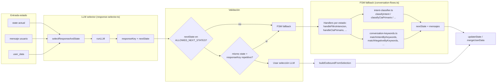
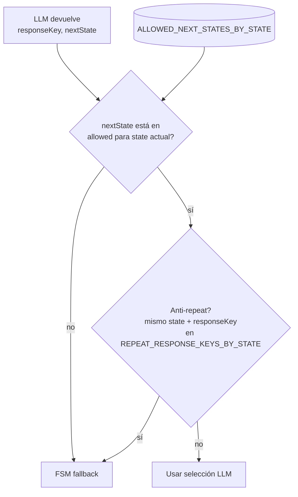
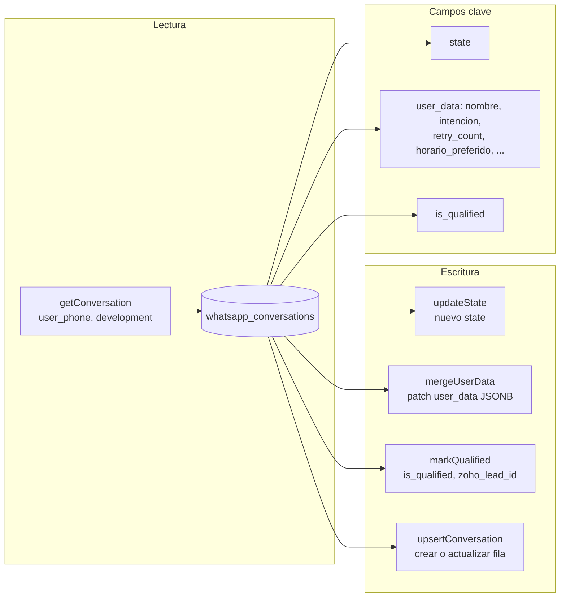
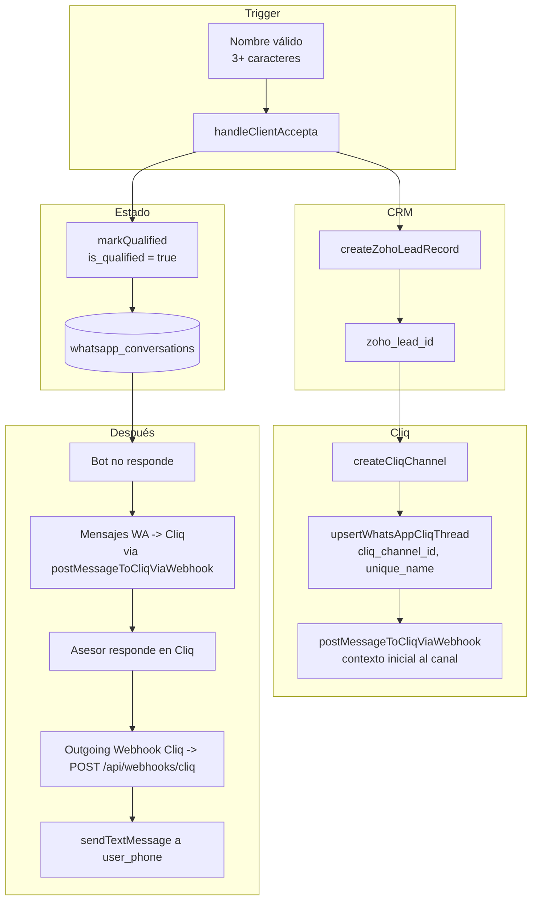

# Arquitectura del motor conversacional (Bot WhatsApp)

Este documento describe la **arquitectura del motor conversacional**: cómo entra un mensaje, cómo se decide la respuesta (LLM + FSM fallback), cómo se valida y persiste el estado, y cómo se hace el handover a Zoho/Cliq. Es el diagrama que **no** muestra la FSM por sí sola y suele ser más útil para devs nuevos en el proyecto.

**Relación con otros docs:**
- **FSM (estados y transiciones):** [fsm-mermaid.md](./fsm-mermaid.md) y [fsm-transiciones-detalle.md](./fsm-transiciones-detalle.md).
- **Flujo general del bot:** [whatsapp-bot.md](./whatsapp-bot.md).

---

## 1. Flujo de alto nivel (entrada a salida)

```mermaid
flowchart TB
    subgraph Entrada
        WA[WhatsApp Cloud API] --> WH[Webhook POST]
        WH --> VAL[Validar payload]
        VAL --> EXT[Extraer texto / routing]
        EXT --> ROUT[phone_number_id -> development, zone]
    end

    subgraph Persistencia
        ROUT --> GET_CONV[getConversation]
        GET_CONV --> DB[(PostgreSQL\nwhatsapp_conversations)]
    end

    subgraph PreFSM["Pre-FSM (handleIncomingMessage)"]
        GET_CONV --> RESET{/reset?}
        RESET -->|sí| RESET_ACT[resetConversation + mensaje]
        GET_CONV --> HORARIO{isBusinessHours?}
        HORARIO -->|sí, no calificado| FUERA[FUERA_HORARIO]
        GET_CONV --> NEW{Conversación existe?}
        NEW -->|no| UPSERT[upsertConversation INICIO]
        UPSERT --> PROC[processState o handleInicio]
        GET_CONV --> QUAL{state = CLIENT_ACCEPTA\no is_qualified?}
        QUAL -->|sí| SILENCIO[outboundMessages = []]
        GET_CONV --> SALIDA{state = SALIDA_ELEGANTE?}
        SALIDA -->|sí| REINICIO[updateState INICIO + handleInicio]
        GET_CONV --> PROC
    end

    subgraph Motor["Motor de respuesta"]
        PROC --> USE_LLM{Estado usa LLM selector?}
        USE_LLM -->|sí| LLM[selectResponseAndState\nresponse-selector.ts]
        LLM --> ALLOW[Allowlist validator\nnextState en ALLOWED_NEXT_STATES?]
        ALLOW -->|no / anti-repeat| FSM[FSM fallback\nhandlers + keywords]
        ALLOW -->|sí| PERSIST1[updateState + mergeUserData]
        FSM --> PERSIST1
        USE_LLM -->|no| FSM
        PERSIST1 --> HANDOVER{Handover?}
        HANDOVER -->|nombre válido| HO[handleClientAccepta]
    end

    subgraph Handover["Handover a asesor"]
        HO --> ZOHO[createZohoLeadRecord]
        ZOHO --> CLIQ[createCliqChannel\n+ postMessageToCliqViaWebhook]
        CLIQ --> MQ[markQualified]
        MQ --> DB
    end

    subgraph Salida
        PERSIST1 --> OUT[FlowResult.outboundMessages]
        HANDOVER -->|no| OUT
        HO --> OUT
        OUT --> SEND[sendText / sendImage / sendDocument]
        SEND --> WA
        RESET_ACT --> SEND
        FUERA --> SEND
        REINICIO --> SEND
    end
```

---

## 2. LLM selector vs FSM fallback (detalle del motor)

En los estados que lo permiten, primero se intenta el **LLM selector**; si no pasa la **allowlist** o hay anti-repeat, se usa el **FSM fallback** (handlers + intent-classifier + keywords).



**Estados que usan LLM selector:** `FILTRO_INTENCION`, `INFO_REINTENTO`, `CTA_PRIMARIO`, `SOLICITUD_HORARIO`, `SOLICITUD_NOMBRE`. El resto (por ejemplo `INICIO`, `CTA_CANAL`) van directo al handler FSM.

**Filtrado de opciones por estado (`STATE_LLM_CONFIG`):** El LLM selector no recibe todos los estados y claves posibles, sino solo los válidos para el estado actual. Cada estado tiene configuradas `validResponseKeys` (3-5 opciones) y `validNextStates` (2-4 opciones). Esto evita que el LLM elija estados legacy o transiciones inválidas.

**Anti-loop (`stuck_in_state_count`):** `processState` es un wrapper que, antes de llamar a la lógica del estado (`processStateCore`), verifica el campo `stuck_in_state_count` en `user_data`. Si el estado no avanzó en 3 mensajes consecutivos, fuerza `SALIDA_ELEGANTE` con razón `'loop_detected'`. El contador se incrementa cuando `nextState === currentState` y se resetea a 0 al avanzar.

---

## 3. Allowlist validator

El LLM puede devolver cualquier `nextState`; el código solo acepta transiciones permitidas para evitar ciclos o retrocesos inválidos.



**Ejemplo:** Desde `CTA_PRIMARIO` solo se aceptan `SOLICITUD_HORARIO`, `SOLICITUD_NOMBRE`, `CTA_CANAL`, `SALIDA_ELEGANTE`. Si el LLM devuelve `FILTRO_INTENCION`, se rechaza y se usa el handler FSM.

---

## 4. Persistencia (estado en DB)

Todo el estado de la conversación vive en **PostgreSQL** (tabla `whatsapp_conversations`). No se usa Redis en la implementación actual.



- **state:** estado actual de la FSM.
- **user_data:** datos acumulados (nombre, intención, preferred_action, lead_quality, disqualified_reason, etc.).
- **is_qualified:** true tras handover; el bot deja de responder automáticamente.

---

## 5. Handover a Zoho CRM y Zoho Cliq

Cuando el usuario da nombre válido en `SOLICITUD_NOMBRE`, se ejecuta `handleClientAccepta`: se crea el lead en CRM, se crea el canal en Cliq y se marca la conversación como calificada. Los mensajes posteriores del usuario se reenvían al canal Cliq (bridge WA -> Cliq) y el bot no genera respuesta automática.



---

## 6. Resumen de módulos y responsabilidades

| Componente | Archivo / ubicación | Responsabilidad |
|------------|----------------------|-----------------|
| **Webhook** | `src/app/api/webhooks/whatsapp/route.ts` | Entrada HTTP, validación payload, deduplicación de mensajes (`claimWhatsAppMessage`), routing, llamada a `handleIncomingMessage`, envío de mensajes y log. |
| **Deduplicación** | `src/lib/db/postgres.ts` (`claimWhatsAppMessage`) + tabla `whatsapp_message_dedup` (migración 045) | `INSERT ... ON CONFLICT DO NOTHING` atómico; descarta webhooks duplicados (WhatsApp reenvía el mismo evento hasta 6 veces). |
| **Persistencia** | `src/lib/modules/whatsapp/conversation-state.ts` | getConversation, upsertConversation, updateState, mergeUserData, markQualified. |
| **Motor (orquestador)** | `src/lib/modules/whatsapp/conversation-flows.ts` | handleIncomingMessage, pre-FSM, processState, allowlist, handlers FSM (handleFiltroIntencion, handleCtaPrimario, handleClientAccepta, handleSalidaElegante, etc.). |
| **LLM selector** | `src/lib/modules/whatsapp/response-selector.ts` | selectResponseAndState: LLM elige responseKey y nextState desde el banco por desarrollo. |
| **Allowlist** | `conversation-flows.ts` (const ALLOWED_NEXT_STATES_BY_STATE) | Validar que el nextState devuelto por el LLM esté permitido desde el estado actual. |
| **Intent classifier** | `src/lib/modules/whatsapp/intent-classifier.ts` | classifyIntent, classifyCtaPrimario, classifyCtaCanal (LLM) para el fallback FSM. |
| **Keywords** | `src/lib/modules/whatsapp/conversation-keywords.ts` | matchIntentByKeywords, matchNegativeByKeywords, matchCtaPrimarioByKeywords, isOnlyGreeting, etc. |
| **Contenido** | `development-content.ts`, `media-handler.ts` | Textos por desarrollo (BIENVENIDA, CTA_AYUDA, …), hero image y brochure. |
| **Handover** | `conversation-flows.ts` (handleClientAccepta) + `zoho-crm`, `zoho-cliq`, `whatsapp-cliq` | createZohoLeadRecord, createCliqChannel, postMessageToCliqViaWebhook, upsertWhatsAppCliqThread, markQualified. |

---

*Documento pensado para onboarding: ver la FSM en [fsm-mermaid.md](./fsm-mermaid.md) y el detalle de transiciones en [fsm-transiciones-detalle.md](./fsm-transiciones-detalle.md).*
