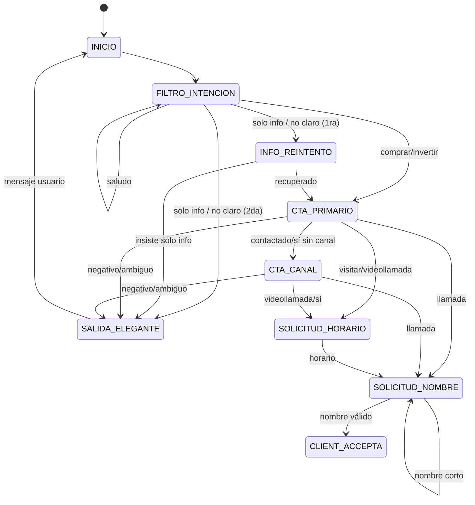
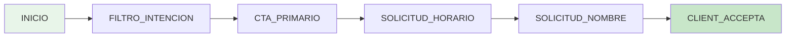
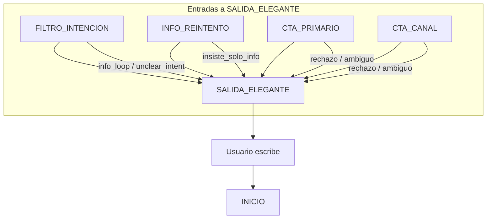

# Diagrama Mermaid: Máquina de Estados Finitos (FSM) - Bot WhatsApp

Diagrama completo de la FSM con todos los flujos y transiciones. Basado en `fsm-transiciones-detalle.md` y `whatsapp-bot.md`.

---

## Diagrama principal (stateDiagram-v2)

```mermaid
stateDiagram-v2
    direction TB

    [*] --> INICIO

    state INICIO {
    }

    state FILTRO_INTENCION {
    }

    state INFO_REINTENTO {
    }

    state CTA_PRIMARIO {
    }

    state CTA_CANAL {
    }

    state SOLICITUD_HORARIO {
    }

    state SOLICITUD_NOMBRE {
    }

    state CLIENT_ACCEPTA {
        note right of CLIENT_ACCEPTA : Bot no responde.\nHandover a asesor.
    }

    state SALIDA_ELEGANTE {
        note right of SALIDA_ELEGANTE : Lead descalificado.\nSiguiente mensaje reinicia a INICIO.
    }

    %% INICIO: solo transición automática
    INICIO --> FILTRO_INTENCION : [automático] Bienvenida + hero

    %% FILTRO_INTENCION
    FILTRO_INTENCION --> FILTRO_INTENCION : Solo saludo (hola, buenas)
    FILTRO_INTENCION --> CTA_PRIMARIO : Alta intención (comprar/invertir/construir)
    FILTRO_INTENCION --> INFO_REINTENTO : Solo info o no claro (1ra vez)
    FILTRO_INTENCION --> SALIDA_ELEGANTE : Solo info o no claro (retry >= 1)

    %% INFO_REINTENTO
    INFO_REINTENTO --> CTA_PRIMARIO : Sí / comprar / invertir (recuperado)
    INFO_REINTENTO --> SALIDA_ELEGANTE : Sigue solo info o duda

    %% CTA_PRIMARIO
    CTA_PRIMARIO --> SALIDA_ELEGANTE : Negativo (no gracias, luego, etc.)
    CTA_PRIMARIO --> SOLICITUD_HORARIO : Visitar / videollamada
    CTA_PRIMARIO --> SOLICITUD_NOMBRE : Llamada (short-circuit)
    CTA_PRIMARIO --> CTA_CANAL : Contactado genérico o sí sin canal
    CTA_PRIMARIO --> SALIDA_ELEGANTE : Ambiguo

    %% CTA_CANAL
    CTA_CANAL --> SALIDA_ELEGANTE : Negativo o ambiguo
    CTA_CANAL --> SOLICITUD_NOMBRE : Llamada
    CTA_CANAL --> SOLICITUD_HORARIO : Videollamada o sí (default)

    %% SOLICITUD_HORARIO
    SOLICITUD_HORARIO --> SOLICITUD_NOMBRE : Cualquier texto (horario)

    %% SOLICITUD_NOMBRE
    SOLICITUD_NOMBRE --> SOLICITUD_NOMBRE : Nombre < 3 caracteres
    SOLICITUD_NOMBRE --> CLIENT_ACCEPTA : Nombre válido (3+ chars)

    %% CLIENT_ACCEPTA: estado final (sin transición saliente)
    %% SALIDA_ELEGANTE: en siguiente mensaje se fuerza INICIO
    SALIDA_ELEGANTE --> INICIO : Usuario escribe de nuevo
```

---

## Versión simplificada (solo transiciones, sin notas)



---

## Flujo de éxito (camino feliz)

Camino desde entrada hasta lead calificado (CLIENT_ACCEPTA):



Variantes del camino feliz:
- **Visita:** CTA_PRIMARIO (visitar) -> SOLICITUD_HORARIO -> SOLICITUD_NOMBRE -> CLIENT_ACCEPTA
- **Videollamada:** CTA_PRIMARIO (videollamada) -> SOLICITUD_HORARIO -> SOLICITUD_NOMBRE -> CLIENT_ACCEPTA
- **Llamada (short-circuit):** CTA_PRIMARIO (llamada) -> SOLICITUD_NOMBRE -> CLIENT_ACCEPTA
- **Contactado sin canal:** CTA_PRIMARIO -> CTA_CANAL -> (SOLICITUD_HORARIO o SOLICITUD_NOMBRE) -> CLIENT_ACCEPTA

---

## Flujos hacia SALIDA_ELEGANTE



---

## Allowlist (referencia)

Estados a los que se puede pasar desde cada estado (validación en código):

| Estado actual       | Siguientes permitidos |
|---------------------|------------------------|
| INICIO              | FILTRO_INTENCION       |
| FILTRO_INTENCION    | CTA_PRIMARIO, INFO_REINTENTO, SALIDA_ELEGANTE |
| INFO_REINTENTO      | CTA_PRIMARIO, SALIDA_ELEGANTE |
| CTA_PRIMARIO        | SOLICITUD_HORARIO, SOLICITUD_NOMBRE, CTA_CANAL, SALIDA_ELEGANTE |
| CTA_CANAL           | SOLICITUD_HORARIO, SOLICITUD_NOMBRE, SALIDA_ELEGANTE |
| SOLICITUD_HORARIO   | SOLICITUD_NOMBRE       |
| SOLICITUD_NOMBRE    | CLIENT_ACCEPTA, SOLICITUD_NOMBRE |
| CLIENT_ACCEPTA      | (ninguno)              |
| SALIDA_ELEGANTE     | (siguiente mensaje -> INICIO) |

---

*Generado a partir de `conversation-flows.ts`, `fsm-transiciones-detalle.md` y `whatsapp-bot.md`.*
