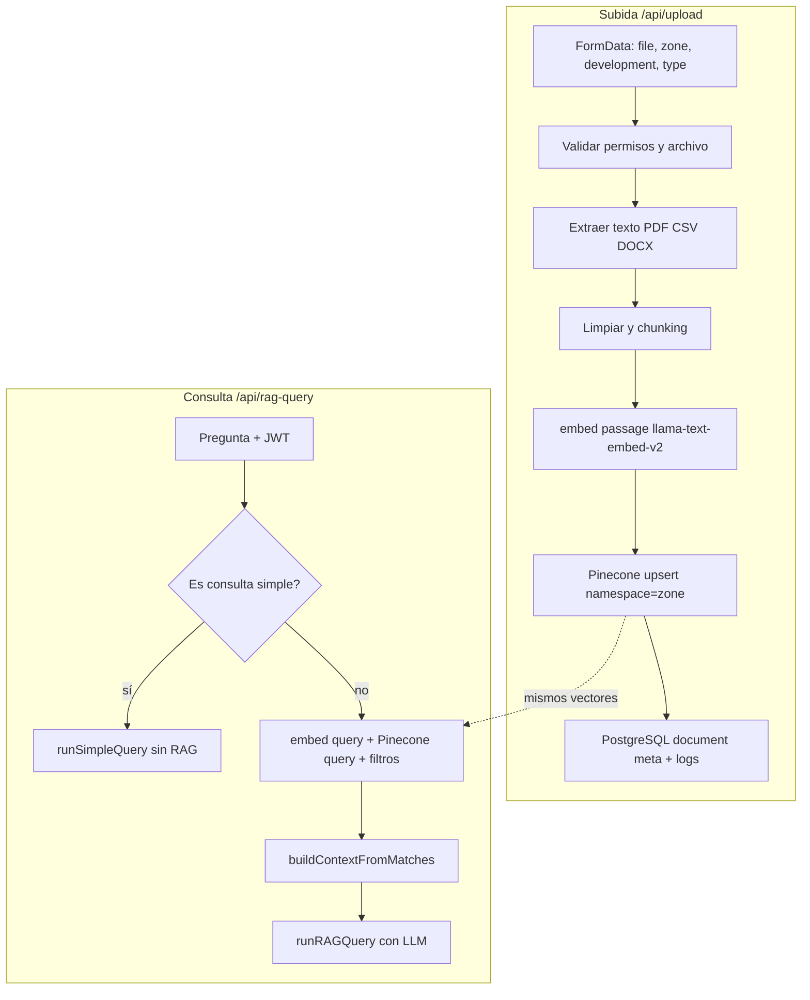

# RAG, embeddings y subida de archivos

Este documento describe cómo encajan entre sí el **agente RAG** (Retrieval-Augmented Generation), la generación de **embeddings** con Pinecone Inference y el flujo de **subida de documentos** en el proyecto Capital Plus AI Agent.

---

## 1. Qué es RAG en este proyecto

**RAG** significa que el modelo de lenguaje (LLM) no inventa la respuesta solo con su memoria interna: primero se **recuperan** fragmentos de texto relevantes de una base vectorial (Pinecone) y esos fragmentos se inyectan como **contexto** en el prompt. Así las respuestas pueden citar información de tus PDFs, CSV y DOCX subidos.

Resumen del ciclo de consulta:

1. El usuario envía una pregunta al endpoint `POST /api/rag-query`.
2. Si la pregunta no es considerada “simple” (saludos, etc.), el sistema genera un **embedding de la pregunta** y busca en Pinecone los chunks más parecidos (similitud vectorial).
3. Esos chunks se formatean como texto de contexto (fuentes numeradas).
4. El LLM recibe la pregunta + el contexto y genera la respuesta, con instrucciones para citar `[1]`, `[2]`, etc.

Archivos clave:

- `src/app/api/rag-query/route.ts` — entrada HTTP, permisos, caché, decisión RAG vs consulta simple.
- `src/lib/db/pinecone.ts` — embeddings, `upsert`, `query`, construcción de contexto.
- `src/lib/services/llm.ts` — `runRAGQuery` (prompt con contexto y memorias).

---

## 2. Embeddings: modelo y significado de `passage` vs `query`

El proyecto usa **Pinecone Inference API** con el modelo integrado **`llama-text-embed-v2`** (dimensión **1024**). No calculas vectores a mano: el SDK `@pinecone-database/pinecone` expone `client.inference.embed(modelo, textos, opciones)`.

Hay dos modos importantes:

| Uso | `inputType` | Dónde |
|-----|----------------|-------|
| Texto de documentos (chunks al indexar) | `passage` | `upsertChunks` en `src/lib/db/pinecone.ts` |
| Pregunta del usuario (y variantes) | `query` | `queryChunks`, caché semántico en `src/lib/infrastructure/cache.ts` |

La API de Pinecone está pensada para que **pasajes** y **consultas** se proyecten de forma coherente en el mismo espacio vectorial, pero usando el tipo correcto mejora la calidad de la búsqueda.

**Lotes:** al generar embeddings hay un límite aproximado de **96 textos por llamada**; el código parte los chunks en batches de 96. Los **upserts** a Pinecone se hacen en batches de **100** registros, con timeouts configurados en `src/lib/utils/timeout.ts`.

---

## 3. Flujo detallado: subida de archivos (`POST /api/upload`)

La subida está implementada en `src/app/api/upload/route.ts`. El dashboard (`src/app/dashboard/upload/page.tsx`) envía un `FormData` con el archivo y metadatos; el cliente usa `uploadDocument` en `src/lib/api.ts`.

### 3.1 Campos del formulario

- `file` — archivo (PDF, CSV o DOCX).
- `zone` — zona geográfica (por ejemplo `yucatan`, `quintana_roo`); define el **namespace** en Pinecone.
- `development` — nombre del desarrollo inmobiliario (se guarda en metadata y filtra en búsqueda).
- `type` — tipo de contenido (`brochure`, `policy`, `price`, `inventory`, etc.); ver `DocumentContentType` en `src/types/documents.ts`.
- `uploaded_by` — ID numérico del usuario.

### 3.2 Validación y permisos

1. Tamaño máximo: `MAX_FILE_SIZE` (por defecto 50 MB, vía env).
2. Extensiones permitidas: `pdf`, `csv`, `docx`.
3. El usuario debe tener permiso `upload_documents` y acceso `can_upload` a la combinación zona + desarrollo (`hasPermission`, `checkUserAccess` en PostgreSQL).

### 3.3 Archivo temporal

El archivo se escribe en disco de forma temporal:

- Directorio: `UPLOAD_DIR` si está definido; si no, se elige entre `./tmp` (desarrollo) o `/tmp` (entornos serverless tipo Vercel/Lambda). Hay fallback si el primer directorio falla.

El nombre incluye timestamp y un nombre “seguro” para evitar colisiones.

### 3.4 Extracción de texto

Según extensión:

- **PDF:** primero `pdf-parse` (rápido). Si el texto es muy escaso, se asume PDF escaneado y se intenta **OCR** (`Tesseract`). Si el OCR está deshabilitado o falla, se devuelve un error orientativo al usuario.
- **CSV:** lectura UTF-8; la primera fila se usa como cabeceras y cada fila se convierte en líneas tipo `columna: valor`.
- **DOCX:** `mammoth.extractRawText`.

Después se **limpia** el texto con funciones específicas por tipo (`cleanPDFText`, `cleanCSVText`, `cleanDOCXText` en `src/lib/utils/cleanText.ts`).

### 3.5 Chunking

Se llama a `createPageAwareChunks` (`src/lib/utils/chunker.ts`) con un solo “bloque” de texto limpio (hoy el documento entero se trata como una página lógica). Parámetros típicos:

- `CHUNK_SIZE` — tokens aproximados por chunk (default 500).
- `CHUNK_OVERLAP` — solapamiento entre chunks (default 50).

Cada chunk recibe un `id` único y metadata: zona, desarrollo, tipo, nombre de archivo, usuario, índices de página/chunk, etc.

### 3.6 Vectorización e indexación (Pinecone)

`upsertChunks(namespace, chunks)` en `src/lib/db/pinecone.ts`:

1. Extrae los textos de los chunks.
2. Genera embeddings con `inputType: 'passage'`.
3. Construye registros: `id`, vector `values`, y **metadata** (incluye el texto completo del chunk para recuperarlo en las búsquedas).

El **namespace** es la **zona** (`zone`), no el nombre del archivo. Eso agrupa todos los documentos de esa zona en el mismo espacio de nombres; el filtro por `development` y `type` se aplica en la consulta.

### 3.7 Persistencia y efectos secundarios

- **PostgreSQL:** `saveDocumentMeta` guarda fila de documento (nombre, zona, desarrollo, tipo, namespace, tags derivados del nombre).
- **Logs:** `saveActionLog` registra la subida (IP, user-agent, número de chunks, tiempo).
- **Caché en memoria:** se invalidan patrones `documents*`, `developments*`, `stats*`.
- Se elimina el archivo temporal.

La respuesta JSON incluye `chunks`, `pinecone_namespace` y `document_id` si aplica.

---

## 4. Flujo detallado: consulta RAG (`POST /api/rag-query`)

1. **Autenticación** con JWT; el `userId` efectivo respeta reglas admin vs usuario normal.
2. Validación del body (esquema Zod), permisos `query_agent` y `can_query` para zona/desarrollo.
3. **`processQuery`** — normalización/expansión del texto de la pregunta (también se usa dentro de `queryChunks` para el embedding).
4. Comprobación de salud del proveedor LLM.
5. **Consultas “simples”** (`isSimpleQuery`): saludos y mensajes muy cortos sin palabras clave de negocio → **`runSimpleQuery`** sin Pinecone.
6. En caso contrario, opcionalmente **caché de respuestas** (`findCachedResponse`): puede usar embeddings de tipo `query` en un namespace de caché para encontrar preguntas similares.
7. **RAG:** `queryChunks(zone, { development, type? }, processedQuery, topK)`:
   - Embedding del query con `inputType: 'query'`.
   - Búsqueda con filtro Pinecone: `development` obligatorio; `type` opcional.
   - Se piden más resultados (`topK * 2`) y luego **re-ranking** usando estadísticas de chunks (`chunk_stats`):  
     `score_final = similarity * 0.8 + success_ratio * 0.2`.
   - Si hay pocos buenos matches, se pueden probar **variantes** de la pregunta (`generateQueryVariants`).
8. **`buildContextFromMatches`:** arma un único string con bloques `[Fuente N: archivo, Página P]` y el texto del chunk.
9. **`runRAGQuery`:** system prompt (con memorias del agente si aplica) + mensaje de usuario con pregunta y contexto; el modelo devuelve la respuesta con citas.
10. Registro en BD (`saveQueryLog`, `registerQueryChunks`, etc.) según la lógica del endpoint.

---

## 5. Diagrama de flujo (subida y consulta)

---

## 6. Variables de entorno relacionadas (referencia)

| Variable | Rol típico |
|----------|------------|
| `PINECONE_API_KEY` | Autenticación con Pinecone |
| `PINECONE_INDEX_NAME` | Nombre del índice (default `capitalplus-rag`) |
| `CHUNK_SIZE` / `CHUNK_OVERLAP` | Tamaño y solapamiento de chunks |
| `MAX_FILE_SIZE` | Tamaño máximo de subida |
| `UPLOAD_DIR` | Override del directorio temporal |

---

## 7. Ideas para aprender más

- **Embeddings:** son representaciones numéricas del “significado” del texto; textos parecidos tienen vectores cercanos en 1024 dimensiones.
- **Namespace:** separa datos por zona sin mezclar vectores de Yucatán con los de Quintana Roo en la misma búsqueda (cada consulta apunta a un namespace).
- **Metadata:** permite filtrar por desarrollo y tipo sin re-embedar todo el índice.

Para el sistema de aprendizaje continuo (feedback, re-ranking, memorias), ver `docs/LEARNING_SYSTEM.md`.
